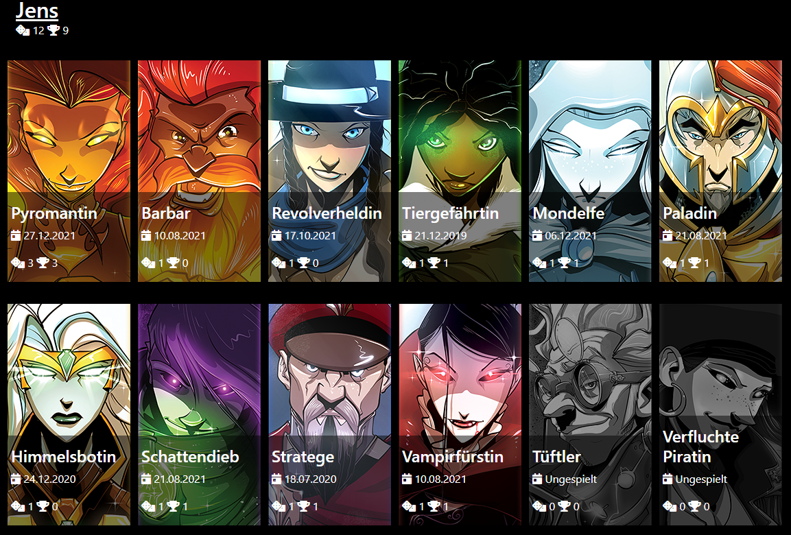

# DiceThrone Progress Watcher

[DiceThrone](https://shop.dicethrone.com/) &copy; is one of my favorite board games. 
And since there are so many cool characters, it's easy to lose track of who has played which character. 
Questions like "*Have I played this one before?*" are not uncommon, especially if you only meet irregularly.

Since I log every game on [Boardgamegeek](https://boardgamegeek.com/) and also note who has played which character, 
I just had to write a program that reads and evaluates this data.

## Requirements
You would need to include the name of the character in the "**Team/Color**" field in your logged games. And that per teammate!

The mapping of the names can be found in the [application.properties](src/main/resources/application.properties).

Furthermore, this repro **does not include graphics** (copyright). 
You can of course use your own images, but the UI is based on the images from [DiceThrone Hero Slider](https://shop.dicethrone.com/pages/heroes). 
But you have to download them yourself.

The UI expects the images in the same folder under the same name (all uppercase) as defined in the [enum](src/main/java/de/agiehl/games/dt/generator/model/PlayableCharacters.java).
File format: .png

### Example
* ARTIFICER.png
* BARBARIAN.png
* CURSED_PIRATE.png
* MOON_ELF.png
* and so on ...

## Technical requirements
To build the application you need a JDK >= 17. 

Since I don't have a proper alerting installed on my server, I've added the [Telegram Logback Appender](https://github.com/paolodenti/telegram-logback): a0e8cfa

This needs to be configured accordingly when **building** it. The [Maven Resources Plugin](https://maven.apache.org/plugins/maven-resources-plugin/examples/filter.html) needs the following variables:

* `botToken`
* `chatId`

Details in the [Telegram Logback Appender](https://github.com/paolodenti/telegram-logback).

At runtime the application also needs some information which can be set as described in the [Spring documentation](https://docs.spring.io/spring-boot/docs/current/reference/html/features.html#features.external-config):

| Property name  | Description | 
| ------------- | ------------- |
| `bgg.api.usernames`  | comma separated list of [Boardgamegeek](https://boardgamegeek.com/) usernames whose game statistics should be included. |
| `output.html.folder`  | Folder in which the HTML should be written  | 
| `spring.datasource.url` | Path and file name for the H2 database. Without specification the database is not persistent and it is not possible to run the application in a delta mode. |

All further info to start the application could be found in the [Spring Documentation](https://docs.spring.io/spring-boot/docs/current/reference/html/using.html#using.running-your-application).
